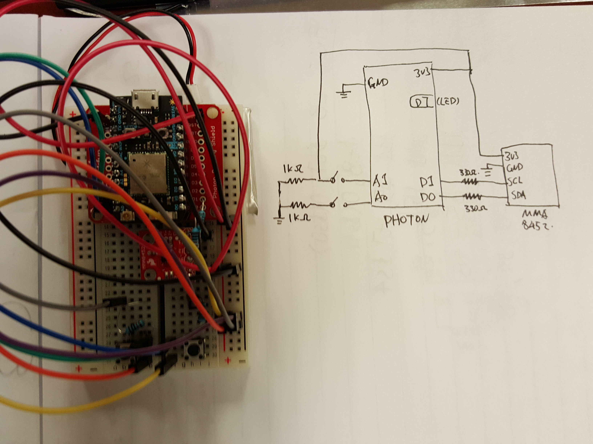

# HCIN720-IA2
GitHub repository for Indepent Assignment 2, HCIN 720, 2015

Created at 9/19/2015 by Yebai Zhao

The Cloud_01 is an early try of using a gravity sensor to control the camera moving in a 3D screen. Inspired by a example code from Three.js http://threejs.org/examples/

The Cloud_02 folder contains a fun little game using the Photon as a controller to fly a spaceship. Modified from Paper.js example library.

The local folder has the local version, with better control and a blinking blue led we your ship died.

Cloud01 page address: http://rawgit.com/YebaiZhao/HCIN720-IA2/master/cloud_01/index.html

Cloud02 page address: https://rawgit.com/YebaiZhao/HCIN720-IA2/master/cloud_02/cloud_02.html

